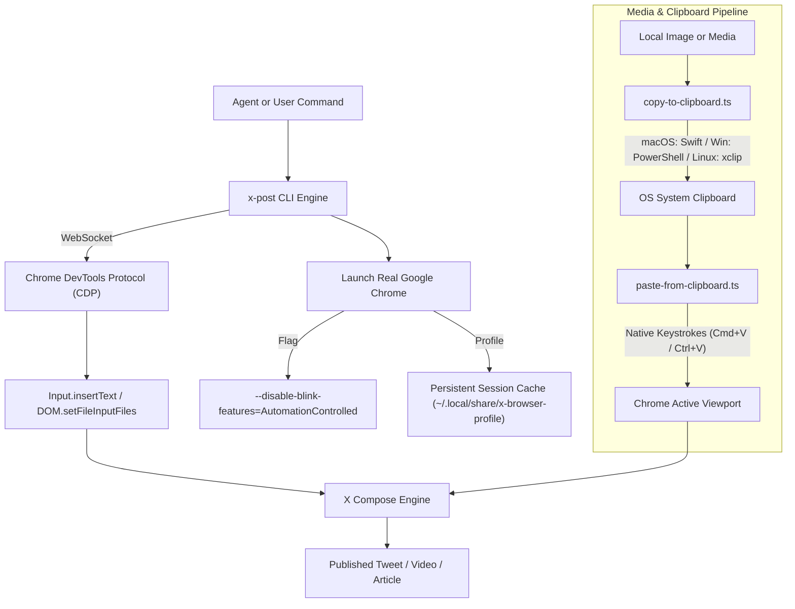

<div align="center">

# 🐦 x-post

### Universal Agent Skill & CLI for Publishing to X (Twitter)
**Anti-bot resilient • Real Chrome CDP • Posts, Videos, Quote Tweets, X Articles & Video Translation**

[](LICENSE)
[](https://bun.sh)
[](https://www.typescriptlang.org/)
[](https://skills.sh)
[](https://claude.ai)
[](SKILL.md)

<p align="center">
  <a href="#-key-features">Features</a> •
  <a href="#-quickstart">Quickstart</a> •
  <a href="#-universal-distribution">Universal Distribution</a> •
  <a href="#-architecture--anti-bot-bypass">Architecture</a> •
  <a href="#-cli-reference">CLI Reference</a> •
  <a href="#-troubleshooting">Troubleshooting</a>
</p>

</div>

---

## ⚡ Overview

**`x-post`** is a production-grade, anti-bot-resilient agent skill and CLI toolchain for publishing rich media, thread sequences, long-form Markdown articles, and multi-language video translation workflows directly to **X (formerly Twitter)**.

Unlike fragile API wrappers or easily blocked headless automation tools (Puppeteer / Playwright), `x-post` commands a **real Google Chrome instance** through the **Chrome DevTools Protocol (CDP)** with persistent session cookies and native OS hardware keystrokes for clipboard media pasting.

---

## ✨ Key Features

| Feature | Capability | Details |
|---|---|---|
| 📝 **Regular Posts** | Text copy + up to 4 images (PNG, JPG, GIF, WebP) | Full emoji & multi-line UTF-8 support |
| 🧵 **Thread Chains** | Multi-tweet sequences via `--reply` | Automatically clicks `+` to add sequential tweets |
| 🎬 **Video Posts** | MP4, MOV, WebM uploads | Automated transcode monitoring and upload readiness polling |
| 💬 **Quote Tweets** | Quote any public status with commentary | Preserves original creator attribution |
| 📰 **X Articles** | Long-form Markdown publishing with cover images | Rich HTML generation + DraftEditor image insertion |
| 🌐 **Video Translation** | Ingest video tweet → Whisper transcribe → Translate → Burn subtitles with FFmpeg → Republish | Multi-language support (EN, AR, ES, FR, ZH, JA, etc.) |
| 🛡️ **Anti-Bot Bypass** | Real Chrome instance + CDP + OS Hardware Pasting | Bypasses Cloudflare, Arkose Labs & CDP synthetic blocks |
| 🤖 **Universal Agent Support** | Claude Code, Antigravity, Cursor, Codex, OpenCode, Windsurf, Roo Code | Works across all modern agent harnesses |

---

## 🚀 Quickstart

### 1. Instant Zero-Install Run (`npx` / `bunx`)

```bash
# Post text & image in preview mode
npx x-post "Exploring autonomous agent skills!" --image ./screenshot.png

# Post video and publish immediately
npx x-post video --video ./demo.mp4 "Complete System Architecture" --submit

# Publish Markdown document to X Articles
npx x-post article ./post.md --cover ./cover.png --submit
```

### 2. Install as an Agent Skill (Multi-Agent Support)

Clone into your agent's skills directory or run the one-line installer:

```bash
# Automated Multi-Agent Installer (Claude Code, Gemini CLI, Codex, Cursor, etc.)
curl -fsSL https://raw.githubusercontent.com/imMamdouhaboammar/x-post/main/install.sh | bash
```

Or manually install for your specific environment:

```bash
# Claude Code (User Level)
git clone https://github.com/imMamdouhaboammar/x-post.git ~/.claude/skills/x-post

# Claude Code (Project Level)
mkdir -p .claude/skills && git clone https://github.com/imMamdouhaboammar/x-post.git .claude/skills/x-post

# Antigravity / Gemini CLI
git clone https://github.com/imMamdouhaboammar/x-post.git ~/.gemini/config/skills/x-post

# Skills.sh Registry
npx skills add https://github.com/imMamdouhaboammar/x-post
```

---

## 🏗️ Architecture & Anti-Bot Bypass



### Why Real Chrome + Native Keystrokes?
1. **No Automation Flags**: Standard automation tools trip `navigator.webdriver = true`. Launching real Chrome bypasses frontend fingerprinting.
2. **Hardware Clipboard Events**: X intercepts synthetic JavaScript / CDP paste events. `x-post` writes media directly to the OS pasteboard and triggers real OS-level keystrokes (`osascript` on macOS, `xdotool` on Linux, PowerShell on Windows).
3. **Session Persistence**: Login once in the opened Chrome window; cookies and tokens stay persisted in `~/.local/share/x-browser-profile`.

---

## 🎬 Video Translation Pipeline


### Usage Steps:

```bash
# Step 1: Ingest URL & generate translation draft
bun scripts/x-translate-video.ts https://x.com/username/status/1234567890 --target-lang English

# Step 2: Fill in /tmp/x-translate/<id>/translation.md

# Step 3: Burn subtitles and preview
bun scripts/x-translate-video.ts --confirm /tmp/x-translate/<id>/translation.md

# Step 4: Burn subtitles and publish
bun scripts/x-translate-video.ts --confirm /tmp/x-translate/<id>/translation.md --submit
```

---

## 📖 CLI Reference

### 1. Regular Posts (`scripts/x-browser.ts`)
```bash
bun scripts/x-browser.ts [options] [text]
```
- `--image <path>`: Attach image file (repeatable, max 4).
- `--reply <text>`: Append thread reply tweet (repeatable).
- `--submit`: Publish immediately (default: 30s preview mode).
- `--profile <dir>`: Custom Chrome user data directory.

### 2. Video Posts (`scripts/x-video.ts`)
```bash
bun scripts/x-video.ts --video <path> [options] [text]
```
- `--video <path>`: Path to MP4, MOV, or WebM video.
- `--reply <text>`: Append thread reply with citations/links.
- `--submit`: Publish immediately (default: preview mode).

### 3. Quote Tweets (`scripts/x-quote.ts`)
```bash
bun scripts/x-quote.ts <tweet-url> [options] [comment]
```
- `<tweet-url>`: Valid X status link (`https://x.com/user/status/...`).
- `[comment]`: Commentary text.
- `--submit`: Publish immediately.

### 4. X Articles (`scripts/x-article.ts`)
```bash
bun scripts/x-article.ts <markdown_file> [options]
```
- `--title <title>`: Override article title.
- `--cover <image>`: Override cover hero image.
- `--submit`: Publish immediately (default: draft preview).

### 5. Markdown to HTML Converter (`scripts/md-to-html.ts`)
```bash
bun scripts/md-to-html.ts <markdown_file> [--output json|html] [--save-html <path>]
```

---

## ⚙️ Environment Variables

| Variable | Description | Default |
|---|---|---|
| `X_BROWSER_CHROME_PATH` | Explicit path to Google Chrome or Chromium executable | Auto-discovered |
| `WHISPER_MODEL` | Path to Whisper ggml model binary | `~/.cache/whisper/ggml-base.bin` |
| `X_TRANSLATE_WORK_DIR` | Working directory for temporary video translation assets | `/tmp/x-translate` |
| `XDG_DATA_HOME` | Base directory for profile storage | `~/.local/share` |

---

## 🛠️ Troubleshooting

- **First Run Login**: On first launch, Chrome will open to `x.com/compose/post`. Log in manually; your session is saved automatically.
- **macOS Accessibility Permission**: If clipboard pasting fails, grant your terminal emulator Accessibility permissions in `System Settings > Privacy & Security > Accessibility`.
- **X Articles Availability**: Long-form article authoring requires an active **X Premium+** or Verified subscription.
- Read full diagnosis guide in [references/troubleshooting.md](references/troubleshooting.md).

---

## 🤝 Contributing

Contributions are welcome! Please read [CONTRIBUTING.md](CONTRIBUTING.md) and adhere to the [Code of Conduct](CODE_OF_CONDUCT.md).

1. Fork the repository
2. Create your feature branch (`git checkout -b feat/amazing-feature`)
3. Test with `bun test` and evaluate with `python3 ~/.gemini/config/skills/skill-conductor/scripts/eval_skill.py .`
4. Commit your changes (`git commit -m 'feat: add amazing feature'`)
5. Push to the branch (`git push origin feat/amazing-feature`)
6. Open a Pull Request

---

## 📄 License

Distributed under the MIT License. See [LICENSE](LICENSE) for more information.

<div align="center">
  <sub>Built with ❤️ by <a href="https://github.com/imMamdouhaboammar">Mamdouh Aboammar</a></sub>
</div>
