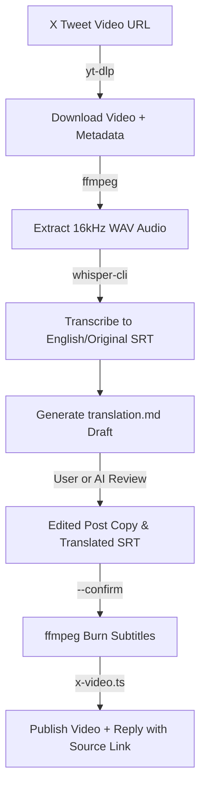

# Video Translation & Subtitle Workflow

The `x-translate-video.ts` script provides an automated pipeline to ingest foreign-language video tweets, extract & transcribe audio with Whisper, produce editable translation documents, burn subtitles with FFmpeg, and republish with original source attribution.

## End-to-End Pipeline



## Step-by-Step Execution

### Step 1: Ingest URL & Generate Draft
```bash
# Ingest tweet video and generate translation.md
bun scripts/x-translate-video.ts https://x.com/username/status/123456789 --target-lang English
```
Output folder is created under `/tmp/x-translate/<tweet-id>/` with:
- `original.mp4`: Downloaded high-resolution video
- `original.srt`: Whisper transcription
- `translation.md`: Markdown review document

### Step 2: Edit Translation Document
Open `/tmp/x-translate/<tweet-id>/translation.md` and fill in:
1. `## Translated Post Text (Review & Edit)`: The localized tweet copy.
2. `## Translated Subtitles`: The localized SRT subtitle text.

### Step 3: Synthesize Subtitled Video & Preview
```bash
bun scripts/x-translate-video.ts --confirm /tmp/x-translate/<tweet-id>/translation.md
```

### Step 4: Publish to X
```bash
bun scripts/x-translate-video.ts --confirm /tmp/x-translate/<tweet-id>/translation.md --submit
```

## Subtitle Styling Configuration

Subtitles are burned using FFmpeg's `subtitles` filter with crisp styling optimized for mobile and desktop feeds:
- `FontSize=22`: High legibility across screen sizes
- `PrimaryColour=&HFFFFFF`: Clean pure white text
- `OutlineColour=&H000000`: Deep black outline for readability on light video frames
- `Outline=2`: 2px border radius
- `MarginV=25`: Comfortable bottom padding
